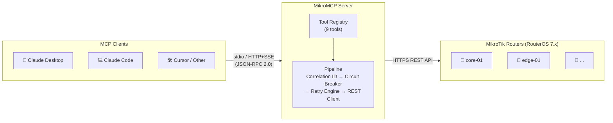

# 🔧 MikroMCP

> A production-grade [Model Context Protocol (MCP)](https://modelcontextprotocol.io) server that gives AI assistants (Claude, Cursor, etc.) safe, structured access to MikroTik RouterOS devices via the RouterOS REST API.

---

## 💡 What it does

MikroMCP exposes MikroTik router management as MCP tools. An AI assistant connected to MikroMCP can query system status, list interfaces, manage VLANs, IP addresses, DHCP leases, static routes, and firewall rules — all through natural language, with the server enforcing validation, idempotency, and safety guardrails.

| | |
|---|---|
| ♻️ **Auto-retry** | Read-only tools retry with exponential backoff + jitter on transient failures |
| ✅ **Idempotent writes** | Creating something that already exists returns success, not an error |
| 🔍 **Dry-run mode** | Preview changes on all write tools before applying |
| ⚡ **Circuit breaker** | Per-router — trips after N consecutive failures, self-heals after cooldown |
| 📦 **Dual responses** | Every tool returns both a human-readable summary and a structured JSON block |
| 🔒 **Zero secrets in config** | Credentials come from environment variables, never from YAML |
| 🌐 **Multi-router** | Manage any number of routers from a single server instance |

---

## 🗺️ How it works



---

## 🚀 Quick start

**Requirements:** Node.js >= 22 · MikroTik RouterOS 7.x with REST API enabled

```bash
git clone https://github.com/AliKarami/MikroMCP.git
cd MikroMCP
npm install && npm run build
cp config/routers.example.yaml config/routers.yaml
# Edit config/routers.yaml with your router details
export ROUTER_CORE01_USER=mcp-api
export ROUTER_CORE01_PASS=your-password
npm start
```

Then add to Claude Desktop (`~/Library/Application Support/Claude/claude_desktop_config.json`):

```json
{
  "mcpServers": {
    "mikrotik": {
      "command": "node",
      "args": ["/absolute/path/to/MikroMCP/dist/main.js"],
      "env": {
        "MIKROMCP_CONFIG_PATH": "/absolute/path/to/MikroMCP/config/routers.yaml",
        "ROUTER_CORE01_USER": "mcp-api",
        "ROUTER_CORE01_PASS": "your-password"
      }
    }
  }
}
```

For the full walkthrough including router user setup, see the **[📖 Setup Guide](https://github.com/AliKarami/MikroMCP/wiki/Setup-Guide)**.

---

## 🛠️ Available tools

| Tool | Type | Description |
|---|---|---|
| `get_system_status` | 👁️ Read | CPU, memory, uptime, identity |
| `list_interfaces` | 👁️ Read | Network interfaces with filtering and pagination |
| `create_vlan` | ✏️ Write | Create VLAN interfaces (idempotent) |
| `manage_ip_address` | ✏️ Write | Add / update / remove IP addresses |
| `list_dhcp_leases` | 👁️ Read | DHCP lease table with filtering |
| `list_routes` | 👁️ Read | Routing table with active/static filters |
| `manage_route` | ✏️ Write | Add or remove static routes (idempotent) |
| `list_firewall_rules` | 👁️ Read | Filter/NAT rules in evaluation order |
| `manage_firewall_rule` | ✏️ Write | Add / remove / disable / enable firewall rules |

Full parameter tables and example prompts: **[📋 Available Tools](https://github.com/AliKarami/MikroMCP/wiki/Available-Tools)**

---

## 📚 Documentation

| | |
|---|---|
| [🏗️ Architecture](https://github.com/AliKarami/MikroMCP/wiki/Architecture) | System layers and request pipeline |
| [📖 Setup Guide](https://github.com/AliKarami/MikroMCP/wiki/Setup-Guide) | End-to-end from bare router to working AI assistant |
| [⚙️ Configuration](https://github.com/AliKarami/MikroMCP/wiki/Configuration) | Router registry YAML, credentials, env vars, HTTP transport |
| [▶️ Running](https://github.com/AliKarami/MikroMCP/wiki/Running) | Dev and production scripts |
| [🔌 Connecting to an MCP Client](https://github.com/AliKarami/MikroMCP/wiki/Connecting-to-an-MCP-Client) | Claude Desktop, Claude Code, and other clients |
| [🛠️ Available Tools](https://github.com/AliKarami/MikroMCP/wiki/Available-Tools) | All 9 tools with parameters and example prompts |
| [🚨 Error Handling](https://github.com/AliKarami/MikroMCP/wiki/Error-Handling) | Error categories, circuit breaker, retry engine |
| [🧪 Development](https://github.com/AliKarami/MikroMCP/wiki/Development) | Project structure, scripts, testing, MCP Inspector |
| [🤝 Contributing](https://github.com/AliKarami/MikroMCP/wiki/Contributing) | Adding tools, guidelines, PR checklist |
| [🗺️ Roadmap](https://github.com/AliKarami/MikroMCP/wiki/Roadmap) | v0.1 ✅ · v0.2 ✅ · v0.3 planned |

---

## 📄 License

MIT — see [LICENSE](LICENSE).
