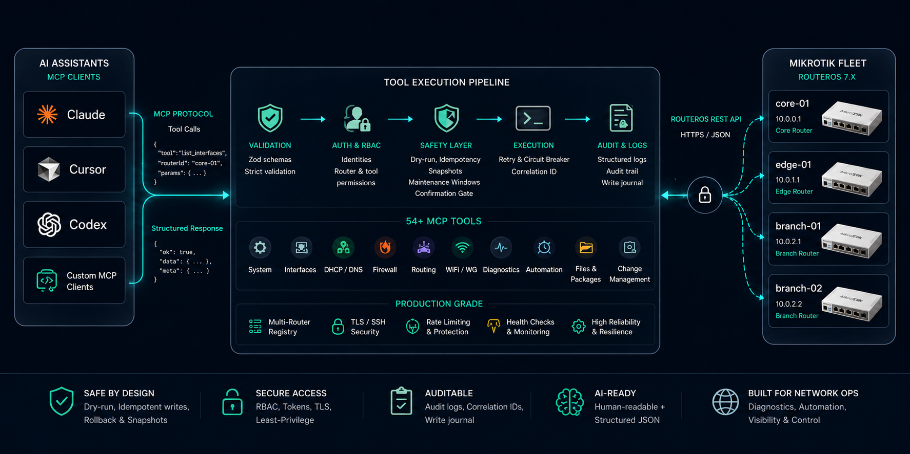
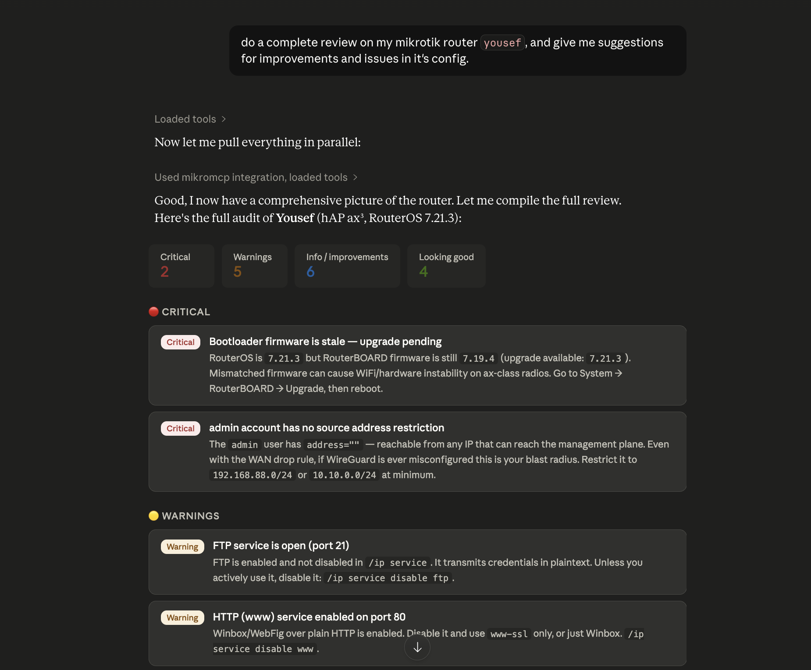
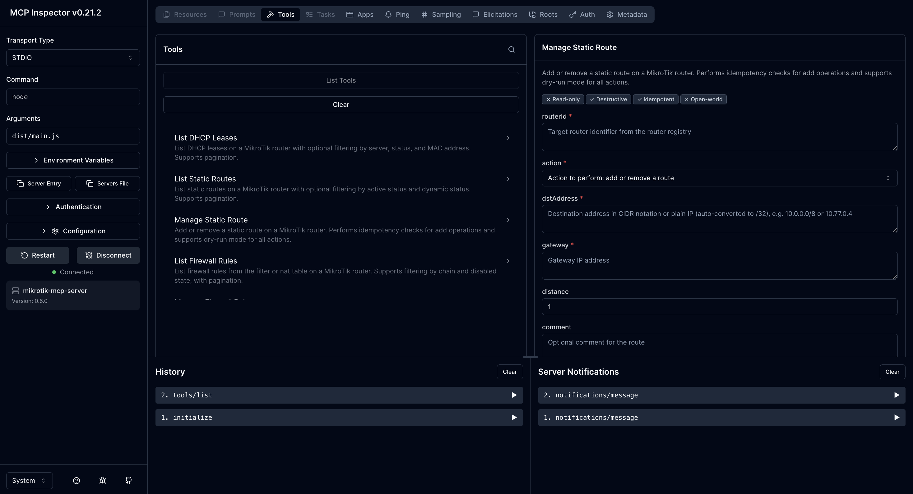
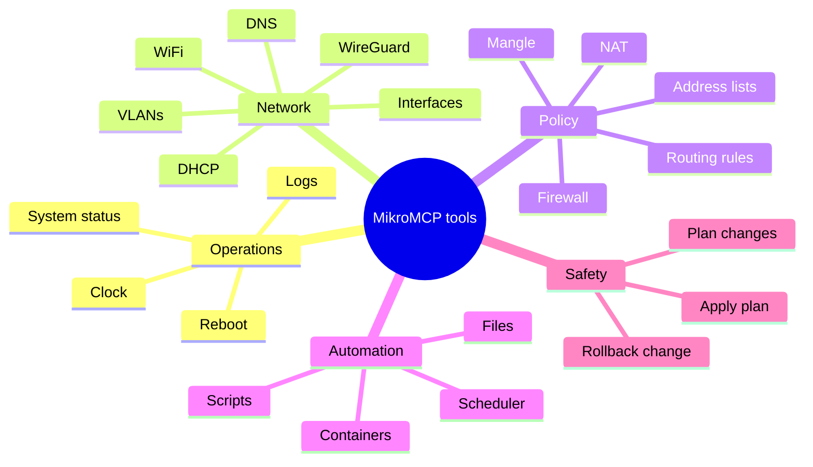

# MikroMCP

<p align="center">
  <picture>
    <source media="(prefers-color-scheme: dark)" srcset="./docs/assets/MikroMCP-logo-dark.png">
    <source media="(prefers-color-scheme: light)" srcset="./docs/assets/MikroMCP-logo-light.png">
    
  </picture>
</p>

> **AI-native network automation for MikroTik RouterOS.** MikroMCP exposes RouterOS as a typed, auditable [Model Context Protocol](https://modelcontextprotocol.io) server so Claude, Cursor, Codex, and other MCP clients can inspect, diagnose, and safely operate MikroTik routers in natural language.

[](https://github.com/AliKarami/MikroMCP/actions/workflows/ci.yml)
[](https://github.com/AliKarami/MikroMCP/actions/workflows/release.yml)
[](package.json)
[](LICENSE)
[](package.json)
[](https://help.mikrotik.com/docs/display/ROS/REST+API)
[](https://modelcontextprotocol.io)
[](#available-tools)
[](https://glama.ai/mcp/servers/AliKarami/MikroMCP)

MikroMCP exists because raw router CLI access is the wrong abstraction for AI agents. RouterOS is powerful, but asking an LLM to improvise shell commands against production network gear is risky. MikroMCP gives agents a controlled tool surface: strict schemas, idempotent writes, dry-run previews, per-router circuit breakers, retry policies, RBAC, audit logs, snapshots, and rollback-aware change workflows.

**In one sentence:** MikroMCP turns MikroTik RouterOS into a production-minded MCP control plane for AI infrastructure, DevOps automation, and modern router management.



---

## Why It Matters

| Instead of...                                | MikroMCP gives you...                                                                                          |
| -------------------------------------------- | -------------------------------------------------------------------------------------------------------------- |
| Hand-written RouterOS CLI snippets from chat | Typed MCP tools with strict Zod validation                                                                     |
| Blind config changes                         | Dry-run previews, idempotency checks, snapshots, and rollback tooling                                          |
| One-off scripts per router                   | A multi-router registry with per-router credentials, tags, TLS, SSH, and maintenance windows                   |
| Raw network access for every assistant       | RBAC identities, bearer tokens for HTTP mode, tool allowlists, and audit trails                                |
| Fragile troubleshooting workflows            | Router-originated ping, traceroute, torch, logs, interfaces, DHCP, firewall, routes, WiFi, WireGuard, and more |

---

## Feature Showcase

| Category                   | What MikroMCP covers                                                                                  |
| -------------------------- | ----------------------------------------------------------------------------------------------------- |
| 🧭 **Router management**   | System status, clock, reboot, packages, files, scripts, scheduler jobs, containers                    |
| 🌐 **Network operations**  | Interfaces, VLANs, IP addresses, DHCP leases, DNS static records, bridge ports, WiFi clients          |
| 🔥 **Firewall and policy** | Filter/NAT rules, mangle rules, address lists, route tables, routing rules                            |
| 🛰️ **Routing visibility**  | Static routes, routing tables, BGP peers, OSPF neighbors                                              |
| 🔐 **Secure access**       | HTTP bearer auth, bcrypt token hashes, RBAC, router/tool restrictions, confirmation tokens            |
| 🧪 **Diagnostics**         | Router-originated `ping`, `traceroute`, `torch`, log filtering, guarded SSH command execution         |
| 🛡️ **Change safety**       | Dry-run, idempotent writes, snapshots, write journal, `plan_changes`, `apply_plan`, `rollback_change` |
| ⚙️ **Production behavior** | Retries for read tools, per-router circuit breakers, correlation IDs, structured logs, audit logs     |
| 🤖 **AI-agent fit**        | Human-readable responses plus structured JSON content for reasoning, chaining, and automation         |
| 🧩 **MCP compatibility**   | stdio for desktop clients, Streamable HTTP and legacy SSE for remote or service-style clients         |

---

## Demo

### Usage

<p align="center">
  
</p>

### Review by Claude



### MCP Inspector



---

## Quick Start

### Prerequisites

- Node.js 22 or newer (for npm install) — or use a standalone binary below
- MikroTik RouterOS 7.x with the REST API enabled
- A RouterOS user with the policies your tools require

Recommended RouterOS policies for full tool coverage:

```text
read, write, api, rest-api, test, ssh, sniff, ftp
```

> `ssh` is required for `ping`, `traceroute`, `torch`, and `run_command`. `sniff` is required by `torch`. `ftp` is required only for `upload_file`.

---

### Install

**npm (recommended)**

```bash
npm install -g mikromcp
```

**Standalone binaries**

Download the binary for your platform from the [latest GitHub release](https://github.com/AliKarami/MikroMCP/releases/latest) — no Node.js required.

**Docker**

```bash
docker pull ghcr.io/alikarami/mikromcp:latest
```

---

### Set Up With the Init Wizard

Run the interactive setup wizard:

```bash
mikromcp init
```

The wizard will ask for your router details and write everything to `~/.mikromcp/`:

```
~/.mikromcp/
├── routers.yaml      # router registry
├── identities.yaml   # RBAC identities (HTTP mode)
└── .env              # credentials and runtime settings
```

`~/.mikromcp/.env` is loaded automatically every time MikroMCP starts — no shell exports or Claude Desktop `env` blocks needed. Fill in the credentials it generates:

```bash
# ~/.mikromcp/.env  (generated by mikromcp init)
ROUTER_CORE01_USER=
ROUTER_CORE01_PASS=
```

To edit your router registry directly:

```bash
nano ~/.mikromcp/routers.yaml
```

```yaml
routers:
  core-01:
    host: "192.168.88.1"
    port: 443
    tls:
      enabled: true
      rejectUnauthorized: true
    credentials:
      source: "env"
      envPrefix: "ROUTER_CORE01"
    tags: ["core"]
    rosVersion: "7"
```

---

### Verify With Doctor

```bash
mikromcp doctor
```

Doctor checks Node version, config files, router reachability, Claude Desktop registration, and whether a newer version is available.

---

### Run

**stdio (for Claude Desktop and other desktop MCP clients)**

```bash
mikromcp serve
```

**HTTP mode (for service deployments)**

```bash
MIKROMCP_TRANSPORT=http mikromcp serve
```

---

## Connect An MCP Client

### Claude Desktop

Run `mikromcp init` and choose **Register with Claude Desktop** — it patches `claude_desktop_config.json` automatically.

Or add it manually to `~/Library/Application Support/Claude/claude_desktop_config.json` on macOS:

```json
{
  "mcpServers": {
    "mikromcp": {
      "command": "mikromcp",
      "args": ["serve"]
    }
  }
}
```

No `env` block needed — credentials are loaded from `~/.mikromcp/.env` at startup. Restart Claude Desktop, then ask:

```text
Use MikroMCP to show CPU, memory, uptime, active interfaces, and warning logs for core-01.
```

### HTTP / SSE Mode

HTTP mode is useful for service deployments and MCP clients that connect over a network endpoint.

Set in `~/.mikromcp/.env`:

```bash
MIKROMCP_TRANSPORT=http
MIKROMCP_PORT=3000
MIKROMCP_CONFIRMATION_SECRET=<openssl rand -hex 32>
```

Then run:

```bash
mikromcp serve
```

Every HTTP request must include:

```text
Authorization: Bearer <token>
```

Tokens are configured as bcrypt hashes in `~/.mikromcp/identities.yaml`. Use `mikromcp init` to generate them.

### Docker

```bash
docker run --rm \
  -e MIKROMCP_TRANSPORT=http \
  -e MIKROMCP_PORT=3000 \
  -e MIKROMCP_CONFIRMATION_SECRET="$(openssl rand -hex 32)" \
  -e ROUTER_CORE01_USER=mcp-api \
  -e ROUTER_CORE01_PASS=your-router-password \
  -e MIKROMCP_CONFIG_PATH=/config/routers.yaml \
  -v "$HOME/.mikromcp:/config:ro" \
  -p 3000:3000 \
  ghcr.io/alikarami/mikromcp:latest
```

Pass `MIKROMCP_CONFIG_PATH` and `MIKROMCP_IDENTITIES_PATH` explicitly when running in Docker since `~/.mikromcp/` inside the container refers to the container's home directory.

---

## Configuration Reference

All settings can be placed in `~/.mikromcp/.env` or passed as environment variables. Values in `~/.mikromcp/.env` are loaded at startup; explicit environment variables always take precedence.

| Variable                          | Default                          | Purpose                                                |
| --------------------------------- | -------------------------------- | ------------------------------------------------------ |
| `MIKROMCP_TRANSPORT`              | `stdio`                          | `stdio` or `http`                                      |
| `MIKROMCP_CONFIG_PATH`            | `~/.mikromcp/routers.yaml`       | Router registry path                                   |
| `MIKROMCP_IDENTITIES_PATH`        | `~/.mikromcp/identities.yaml`    | Identity and bearer-token registry                     |
| `MIKROMCP_STDIO_IDENTITY`         | built-in superadmin              | Named identity for stdio mode                          |
| `MIKROMCP_PORT`                   | `3000`                           | HTTP transport port                                    |
| `MIKROMCP_BIND_HOST`              | `127.0.0.1`                      | HTTP bind address                                      |
| `MIKROMCP_CONFIRMATION_SECRET`    | unset                            | HMAC secret for destructive-action confirmation tokens |
| `MIKROMCP_AUDIT_LOG_PATH`         | unset                            | Optional NDJSON audit log file path                    |
| `MIKROMCP_DATA_DIR`               | `~/.mikromcp/data`               | Snapshots and write-journal directory                  |
| `MIKROMCP_HTTP_MAX_BODY_BYTES`    | `1048576`                        | HTTP request body cap                                  |
| `MIKROMCP_HTTP_RATE_LIMIT_RPM`    | `60`                             | Requests per minute per IP; `0` disables rate limiting |
| `MIKROMCP_SSH_COMMAND_TIMEOUT_MS` | `30000`                          | SSH command timeout                                    |
| `MIKROMCP_SSH_MAX_OUTPUT_BYTES`   | `524288`                         | SSH output cap                                         |
| `MIKROMCP_CMD_ALLOW`              | unset                            | Global allowlist patterns for `run_command`            |
| `MIKROMCP_CMD_DENY`               | unset                            | Global denylist patterns for `run_command`             |
| `ROUTER_<PREFIX>_USER`            | unset                            | Router username from `envPrefix`                       |
| `ROUTER_<PREFIX>_PASS`            | unset                            | Router password from `envPrefix`                       |

---

## Available Tools

MikroMCP currently registers **117 MCP tools**.

| Area                    | Tools                                                                                                                                                                                                     |
| ----------------------- | --------------------------------------------------------------------------------------------------------------------------------------------------------------------------------------------------------- |
| System                  | `get_system_status`, `get_system_clock`, `set_system_clock`, `reboot`                                                                                                                                     |
| Interfaces and IP       | `list_interfaces`, `manage_vlan`, `manage_ip_address`                                                                                                                                                     |
| DHCP and DNS            | `list_dhcp_leases`, `manage_dhcp_lease`, `list_dns_entries`, `manage_dns_entry`, `get_dns_settings`, `manage_dns_settings`                                                                                |
| DHCP Servers & Pools    | `list_dhcp_servers`, `manage_dhcp_server`, `list_ip_pools`, `manage_ip_pool`                                                                                                                              |
| DHCP Clients            | `list_dhcp_clients`, `manage_dhcp_client`                                                                                                                                                                 |
| IP Services             | `list_ip_services`, `manage_ip_service`                                                                                                                                                                   |
| PPPoE & OpenVPN         | `list_pppoe_clients`, `manage_pppoe_client`, `list_ovpn_clients`, `manage_ovpn_client`, `get_ovpn_server`, `manage_ovpn_server`                                                                           |
| PPP Profiles            | `list_ppp_profiles`, `manage_ppp_profile`                                                                                                                                                                 |
| Routing                 | `list_routes`, `manage_route`, `list_routing_rules`, `manage_routing_rule`, `list_routing_tables`, `manage_routing_table`                                                                                 |
| Routing protocols       | `list_bgp_peers`, `list_ospf_neighbors`                                                                                                                                                                   |
| Firewall                | `list_firewall_rules`, `manage_firewall_rule`, `list_mangle_rules`, `manage_mangle_rule`, `list_address_list_entries`, `manage_address_list_entry`, `list_interface_lists`, `manage_interface_list`, `manage_interface_list_member` |
| Bridge, WiFi, WireGuard | `list_bridges`, `manage_bridge`, `manage_bridge_port`, `list_wifi_interfaces`, `list_wifi_clients`, `manage_wifi_interface`, `list_wireguard_interfaces`, `list_wireguard_peers`, `manage_wireguard_peer`, `manage_wireguard_interface` |
| IPSec/VPN               | `list_ipsec_peers`, `list_ipsec_policies`, `manage_ipsec_peer`, `manage_ipsec_policy`                                                                                                                     |
| Certificates            | `list_certificates`, `manage_certificate`                                                                                                                                                                 |
| Users                   | `list_users`, `manage_user`                                                                                                                                                                               |
| Queues/QoS              | `list_queues`, `manage_queue`                                                                                                                                                                             |
| VRRP                    | `list_vrrp_instances`, `manage_vrrp_instance`                                                                                                                                                             |
| SNMP & NTP              | `get_snmp_settings`, `get_ntp_settings`                                                                                                                                                                   |
| Netwatch                | `list_netwatch_entries`, `manage_netwatch_entry`                                                                                                                                                          |
| Discovery & ARP         | `list_neighbors`, `list_arp_entries`                                                                                                                                                                      |
| Diagnostics             | `ping`, `traceroute`, `torch`, `get_log`, `run_command`, `bandwidth_test`, `fetch_url`, `list_connections`                                                                                                |
| Automation              | `list_scripts`, `manage_script`, `run_script`, `list_scheduled_jobs`, `manage_scheduled_job`                                                                                                              |
| Runtime                 | `list_packages`, `manage_package`, `list_files`, `get_file_content`, `upload_file`, `delete_file`, `list_containers`, `manage_container`, `get_container_config`, `manage_container_config`, `list_container_envs`, `manage_container_env`, `list_container_mounts`, `manage_container_mount` |
| Change management       | `plan_changes`, `apply_plan`, `rollback_change`                                                                                                                                                           |
| Fleet operations        | `check_router_health`, `bulk_execute`                                                                                                                                                                     |



---

## Real-World Usage Examples

### Router Inspection

```text
Use MikroMCP to inspect core-01. Summarize system resources, RouterOS version,
running interfaces, active routes, DNS settings, and recent warning/error logs.
Flag anything that looks operationally risky.
```

### Firewall Management

```text
List firewall filter and NAT rules on edge-01. Identify disabled rules,
overlapping port forwards, broad accept rules, and anything without comments.
Do not change anything yet.
```

### Safe Static Route Change

```text
Dry-run a route on core-01 for 10.20.0.0/16 via 192.168.88.1 in the main table.
Show the exact planned diff and tell me whether an existing route conflicts.
```

### WireGuard Operations

```text
Show WireGuard peers on branch-02. Sort by last handshake age and flag peers
that have not handshaken recently or have no transfer counters.
```

### Interface Diagnostics

```text
Check interface health on edge-01, then run ping and traceroute from the router
to 1.1.1.1. If packet loss is present, use torch on the WAN interface for a
short traffic snapshot.
```

### Plan / Apply / Rollback Workflow

```text
Create a change plan that adds a DNS record and a firewall address-list entry
on edge-01. Use dry-run first, explain the plan, then wait for approval before
applying anything.
```

---

## Why MikroMCP Is Useful For AI Agents

MCP gives LLMs a standard way to call tools. MikroMCP makes RouterOS a high-quality MCP target by turning network operations into well-described, machine-readable, permission-aware actions.

AI assistants can use MikroMCP to:

- Investigate router state without memorizing RouterOS command syntax.
- Chain tool calls across interfaces, routes, firewall rules, logs, and diagnostics.
- Return both operator-friendly summaries and structured JSON for follow-up reasoning.
- Preview changes before mutation and explain exactly what would happen.
- Respect tool-level authorization, router scoping, maintenance windows, and confirmation gates.

---

## Documentation

| Resource                                                                                              | Use it for                                                 |
| ----------------------------------------------------------------------------------------------------- | ---------------------------------------------------------- |
| [ROADMAP.md](ROADMAP.md)                                                                              | Shipped milestones and planned work                        |
| [Getting Started](https://github.com/AliKarami/MikroMCP/wiki/Getting-Started)                         | Install, configure, and connect in 15 minutes              |
| [RouterOS API Setup](https://github.com/AliKarami/MikroMCP/wiki/RouterOS-API-Setup)                   | Enable the REST API, create a user, TLS and firewall       |
| [Configuration](https://github.com/AliKarami/MikroMCP/wiki/Configuration)                             | Router registry, credentials, all environment variables    |
| [Connecting to Claude Desktop](https://github.com/AliKarami/MikroMCP/wiki/Connecting-to-Claude-Desktop) | Register MikroMCP in Claude Desktop                      |
| [Connecting to AI Assistants](https://github.com/AliKarami/MikroMCP/wiki/Connecting-to-AI-Assistants) | Claude Code, Cursor, Codex, HTTP/Docker/systemd            |
| [Available Tools](https://github.com/AliKarami/MikroMCP/wiki/Available-Tools)                         | All 117 tools — parameters and example prompts              |
| [Architecture](https://github.com/AliKarami/MikroMCP/wiki/Architecture)                               | System layers, request pipeline, auth model                |
| [Error Handling](https://github.com/AliKarami/MikroMCP/wiki/Error-Handling)                           | Error categories, retry engine, circuit breaker            |
| [Running](https://github.com/AliKarami/MikroMCP/wiki/Running)                                         | Run commands, HTTP transport, troubleshooting              |
| [Development](https://github.com/AliKarami/MikroMCP/wiki/Development)                                 | Project structure, tests, MCP Inspector workflow           |
| [Contributing](https://github.com/AliKarami/MikroMCP/wiki/Contributing)                               | Adding tools, coding conventions, PR checklist             |

---

## Development

```bash
npm run dev          # tsx watch hot-reload
npm run build        # build ESM output to dist/main.js
npm start            # run built server
npm test             # vitest + tsc + eslint
npm run format       # Prettier
```

Key project paths:

| Path                             | Purpose                                                                                     |
| -------------------------------- | ------------------------------------------------------------------------------------------- |
| `src/main.ts`                    | Loads `~/.mikromcp/.env` and starts stdio or HTTP transport                                 |
| `src/mcp/tool-registry.ts`       | Registers tools and applies auth, retry, circuit breaker, audit, snapshots, and credentials |
| `src/domain/tools/`              | Tool definitions and handlers                                                               |
| `src/domain/snapshot/`           | Snapshot, diff, and write-journal support                                                   |
| `src/adapter/rest-client.ts`     | RouterOS REST API client                                                                    |
| `src/adapter/ssh-client.ts`      | SSH execution adapter for diagnostics and guarded commands                                  |
| `src/config/router-registry.ts`  | Router inventory loader                                                                     |
| `src/cli/init.ts`                | Interactive setup wizard (`mikromcp init`)                                                  |
| `src/cli/doctor.ts`              | Health check command (`mikromcp doctor`)                                                    |
| `config/routers.example.yaml`    | Example multi-router registry                                                               |
| `config/identities.example.yaml` | Example RBAC identity registry                                                              |

---

## Roadmap

| Milestone | Status     | Focus                                                                                                    |
| --------- | ---------- | -------------------------------------------------------------------------------------------------------- |
| v0.1-v0.6 | ✅ Shipped | Foundation, core tools, diagnostics, services, firewall, routing, automation, files, containers          |
| v0.7      | ✅ Shipped | Identity, bearer auth, RBAC, audit log, confirmation gate                                                |
| v0.8      | ✅ Shipped | Snapshots, write journal, plan/apply, rollback, maintenance windows                                      |
| v0.9      | ✅ Shipped | Fleet operations, IPSec, certificates, users, DHCP servers/pools, queues/QoS, VRRP, SNMP/NTP, Netwatch, discovery, ARP, health checks |
| v1.0      | ✅ Shipped | npm package, standalone binaries, Docker images, `mikromcp init` wizard, `mikromcp doctor`, `~/.mikromcp/` convention |

See [ROADMAP.md](ROADMAP.md) for the complete milestone plan.

---

## Contributing

Issues, bug reports, tool requests, documentation improvements, and pull requests are welcome.

Good first contributions:

- Add a read-only tool for an uncovered RouterOS surface.
- Add screenshots, demo GIFs, or topology diagrams.
- Expand tests around RouterOS response normalization and idempotency edge cases.
- Help validate RouterOS version compatibility across real MikroTik devices and CHR.

Development standards:

- TypeScript strict mode, ESM imports with `.js` extensions
- Zod schemas with `.strict()`, idempotency and `dryRun` for write tools
- `MikroMCPError` for domain errors, focused Vitest coverage for every tool

Please open an issue before large changes so maintainers can align on scope.

---

## Security

MikroMCP controls real network devices. Treat it like an operations system.

- Use least-privilege RouterOS users.
- Prefer TLS verification and certificate fingerprint pinning.
- Keep router credentials in `~/.mikromcp/.env`, not in YAML or shell history.
- Use HTTP mode behind a trusted network boundary.
- Configure identities with the smallest practical `allowedRouters` and `allowedToolPatterns`.
- Enable audit logging (`MIKROMCP_AUDIT_LOG_PATH`) for shared or production use.
- Test write tools with `dryRun: true` before applying changes.

For vulnerabilities or unsafe behavior, open a private security advisory or contact the maintainer before publishing details.

---

## Community And Support

- ⭐ Star the repository if MikroMCP helps your MikroTik or MCP workflow.
- 🍴 Fork it to add RouterOS surfaces your network depends on.
- 🧵 Open an issue for bugs, feature requests, compatibility notes, or documentation gaps.

---

## License

MikroMCP is released under the [MIT License](LICENSE).
