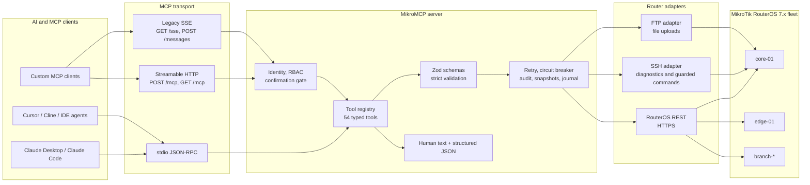
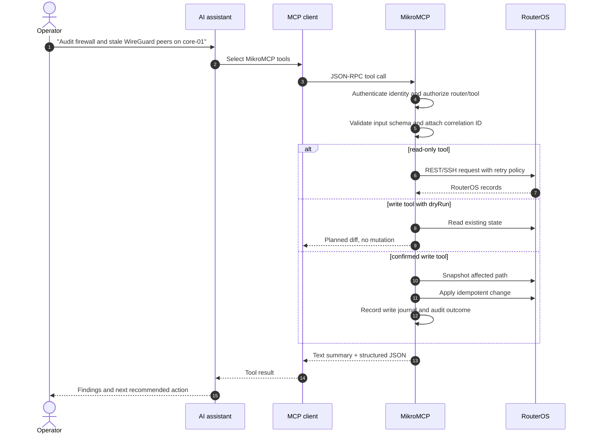
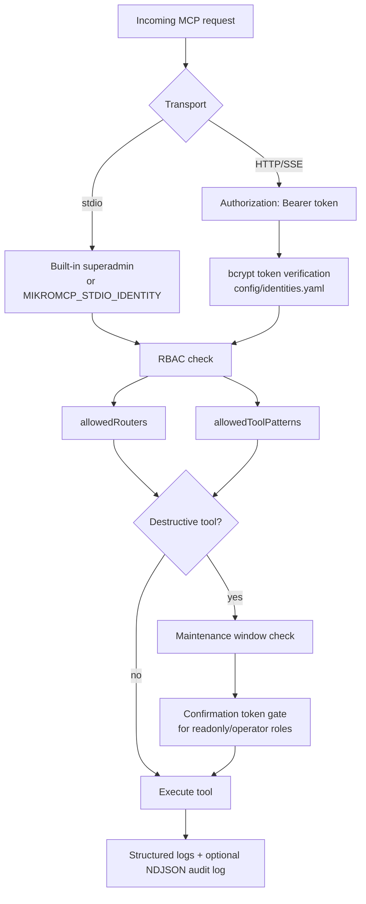
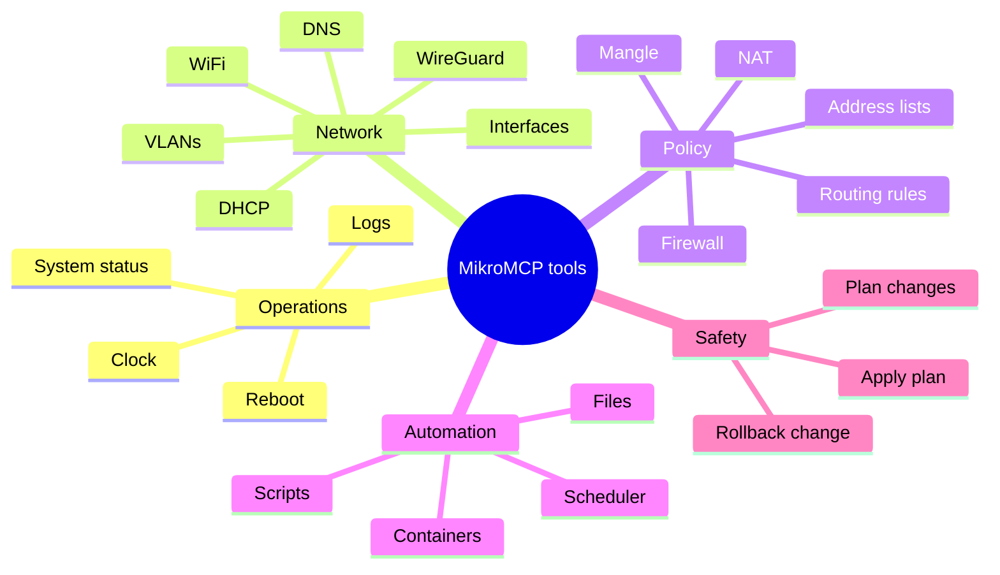

# MikroMCP

<p align="center">
  <picture>
    <source media="(prefers-color-scheme: dark)" srcset="./docs/assets/MikroMCP-logo-dark.png">
    <source media="(prefers-color-scheme: light)" srcset="./docs/assets/MikroMCP-logo-light.png">
    
  </picture>
</p>

> **AI-native network automation for MikroTik RouterOS.** MikroMCP exposes RouterOS as a typed, auditable [Model Context Protocol](https://modelcontextprotocol.io) server so Claude, Cursor, Codex, and other MCP clients can inspect, diagnose, and safely operate MikroTik routers in natural language.

[](https://github.com/AliKarami/MikroMCP/actions/workflows/ci.yml)
[](package.json)
[](LICENSE)
[](package.json)
[](https://help.mikrotik.com/docs/display/ROS/REST+API)
[](https://modelcontextprotocol.io)
[](#available-tools)

MikroMCP exists because raw router CLI access is the wrong abstraction for AI agents. RouterOS is powerful, but asking an LLM to improvise shell commands against production network gear is risky. MikroMCP gives agents a controlled tool surface: strict schemas, idempotent writes, dry-run previews, per-router circuit breakers, retry policies, RBAC, audit logs, snapshots, and rollback-aware change workflows.

**In one sentence:** MikroMCP turns MikroTik RouterOS into a production-minded MCP control plane for AI infrastructure, DevOps automation, and modern router management.


---

## Why It Matters

| Instead of...                                | MikroMCP gives you...                                                                                          |
| -------------------------------------------- | -------------------------------------------------------------------------------------------------------------- |
| Hand-written RouterOS CLI snippets from chat | Typed MCP tools with strict Zod validation                                                                     |
| Blind config changes                         | Dry-run previews, idempotency checks, snapshots, and rollback tooling                                          |
| One-off scripts per router                   | A multi-router registry with per-router credentials, tags, TLS, SSH, and maintenance windows                   |
| Raw network access for every assistant       | RBAC identities, bearer tokens for HTTP mode, tool allowlists, and audit trails                                |
| Fragile troubleshooting workflows            | Router-originated ping, traceroute, torch, logs, interfaces, DHCP, firewall, routes, WiFi, WireGuard, and more |

MikroMCP is especially useful when you want AI agents to help with network operations without giving them unchecked terminal access.

---

## Feature Showcase

| Category                   | What MikroMCP covers                                                                                  |
| -------------------------- | ----------------------------------------------------------------------------------------------------- |
| 🧭 **Router management**   | System status, clock, reboot, packages, files, scripts, scheduler jobs, containers                    |
| 🌐 **Network operations**  | Interfaces, VLANs, IP addresses, DHCP leases, DNS static records, bridge ports, WiFi clients          |
| 🔥 **Firewall and policy** | Filter/NAT rules, mangle rules, address lists, route tables, routing rules                            |
| 🛰️ **Routing visibility**  | Static routes, routing tables, BGP peers, OSPF neighbors                                              |
| 🔐 **Secure access**       | HTTP bearer auth, bcrypt token hashes, RBAC, router/tool restrictions, confirmation tokens            |
| 🧪 **Diagnostics**         | Router-originated `ping`, `traceroute`, `torch`, log filtering, guarded SSH command execution         |
| 🛡️ **Change safety**       | Dry-run, idempotent writes, snapshots, write journal, `plan_changes`, `apply_plan`, `rollback_change` |
| ⚙️ **Production behavior** | Retries for read tools, per-router circuit breakers, correlation IDs, structured logs, audit logs     |
| 🤖 **AI-agent fit**        | Human-readable responses plus structured JSON content for reasoning, chaining, and automation         |
| 🧩 **MCP compatibility**   | stdio for desktop clients, Streamable HTTP and legacy SSE for remote or service-style clients         |

**Best-in-class strengths:** MikroMCP is not just a thin REST wrapper. It models operational safety around RouterOS: typed tool contracts, safe write patterns, router-aware credentials, destructive-action gates, and rollback-oriented workflows.

---

## Demo

### Usage

<p align="center">
  
</p>

### MCP Inspector


---

## Architecture



### Tool Execution Flow



### Authentication And Safety Model



---

## Quick Start

### Prerequisites

- Node.js 22 or newer
- MikroTik RouterOS 7.x with the REST API enabled
- A RouterOS user with the policies required by the tools you plan to use
- Git and npm

Recommended RouterOS policies for full tool coverage:

```text
read, write, api, rest-api, test, ssh, sniff, ftp
```

Notes:

- `ssh` is required for `ping`, `traceroute`, `torch`, and `run_command`.
- `sniff` is required by `torch`.
- `ftp` is required only for `upload_file`.

### Install Locally

```bash
git clone https://github.com/AliKarami/MikroMCP.git
cd MikroMCP
npm install
npm run build
cp config/routers.example.yaml config/routers.yaml
cp config/identities.example.yaml config/identities.yaml
```

Edit `config/routers.yaml`:

```yaml
routers:
  core-01:
    host: "10.0.0.1"
    port: 443
    tls:
      enabled: true
      rejectUnauthorized: true
    credentials:
      source: "env"
      envPrefix: "ROUTER_CORE01"
    tags: ["core", "production"]
    rosVersion: "7.14"
```

Provide router credentials through environment variables:

```bash
export ROUTER_CORE01_USER="mcp-api"
export ROUTER_CORE01_PASS="your-router-password"
npm start
```

### Docker

A Docker image is planned for the v1.0 distribution milestone. Today, run MikroMCP with the local Node.js workflow above or package it behind your own service manager.

---

## Connect An MCP Client

### Claude Desktop

Add MikroMCP to `~/Library/Application Support/Claude/claude_desktop_config.json` on macOS:

```json
{
  "mcpServers": {
    "mikrotik": {
      "command": "node",
      "args": ["/absolute/path/to/MikroMCP/dist/main.js"],
      "env": {
        "MIKROMCP_CONFIG_PATH": "/absolute/path/to/MikroMCP/config/routers.yaml",
        "ROUTER_CORE01_USER": "mcp-api",
        "ROUTER_CORE01_PASS": "your-router-password"
      }
    }
  }
}
```

Restart Claude Desktop, then ask:

```text
Use MikroMCP to show CPU, memory, uptime, active interfaces, and warning logs for core-01.
```

### HTTP / SSE Mode

HTTP mode is useful for service deployments and MCP clients that connect over a local or private network endpoint.

```bash
export MIKROMCP_TRANSPORT=http
export MIKROMCP_PORT=3000
export MIKROMCP_BIND_HOST=127.0.0.1
export MIKROMCP_CONFIRMATION_SECRET="$(openssl rand -hex 32)"
export ROUTER_CORE01_USER="mcp-api"
export ROUTER_CORE01_PASS="your-router-password"
npm start
```

Every HTTP/SSE request must include:

```text
Authorization: Bearer <token>
```

Tokens are configured as bcrypt hashes in `config/identities.yaml`.

---

## Configuration Reference

| Variable                          | Default                  | Purpose                                                |
| --------------------------------- | ------------------------ | ------------------------------------------------------ |
| `MIKROMCP_TRANSPORT`              | `stdio`                  | `stdio` or `http`                                      |
| `MIKROMCP_CONFIG_PATH`            | `config/routers.yaml`    | Router registry path                                   |
| `MIKROMCP_IDENTITIES_PATH`        | `config/identities.yaml` | Identity and bearer-token registry                     |
| `MIKROMCP_STDIO_IDENTITY`         | built-in superadmin      | Named identity for stdio mode                          |
| `MIKROMCP_PORT`                   | `3000`                   | HTTP transport port                                    |
| `MIKROMCP_BIND_HOST`              | `127.0.0.1`              | HTTP bind address                                      |
| `MIKROMCP_CONFIRMATION_SECRET`    | unset                    | HMAC secret for destructive-action confirmation tokens |
| `MIKROMCP_AUDIT_LOG_PATH`         | unset                    | Optional NDJSON audit log file path                    |
| `MIKROMCP_HTTP_MAX_BODY_BYTES`    | `1048576`                | HTTP request body cap                                  |
| `MIKROMCP_HTTP_RATE_LIMIT_RPM`    | `60`                     | Requests per minute per IP; `0` disables rate limiting |
| `MIKROMCP_SSH_COMMAND_TIMEOUT_MS` | `30000`                  | SSH command timeout                                    |
| `MIKROMCP_SSH_MAX_OUTPUT_BYTES`   | `524288`                 | SSH output cap                                         |
| `MIKROMCP_CMD_ALLOW`              | unset                    | Global allowlist patterns for `run_command`            |
| `MIKROMCP_CMD_DENY`               | unset                    | Global denylist patterns for `run_command`             |
| `ROUTER_<PREFIX>_USER`            | unset                    | Router username from `envPrefix`                       |
| `ROUTER_<PREFIX>_PASS`            | unset                    | Router password from `envPrefix`                       |

---

## Available Tools

MikroMCP currently registers **54 MCP tools**.

| Area                    | Tools                                                                                                                                                                                                     |
| ----------------------- | --------------------------------------------------------------------------------------------------------------------------------------------------------------------------------------------------------- |
| System                  | `get_system_status`, `get_system_clock`, `set_system_clock`, `reboot`                                                                                                                                     |
| Interfaces and IP       | `list_interfaces`, `create_vlan`, `manage_ip_address`                                                                                                                                                     |
| DHCP and DNS            | `list_dhcp_leases`, `list_dns_entries`, `manage_dns_entry`, `get_dns_settings`                                                                                                                            |
| Routing                 | `list_routes`, `manage_route`, `list_routing_rules`, `manage_routing_rule`, `list_routing_tables`, `manage_routing_table`                                                                                 |
| Routing protocols       | `list_bgp_peers`, `list_ospf_neighbors`                                                                                                                                                                   |
| Firewall                | `list_firewall_rules`, `manage_firewall_rule`, `list_mangle_rules`, `manage_mangle_rule`, `list_address_list_entries`, `manage_address_list_entry`                                                        |
| Bridge, WiFi, WireGuard | `list_bridges`, `manage_bridge`, `manage_bridge_port`, `list_wifi_interfaces`, `list_wifi_clients`, `manage_wifi_interface`, `list_wireguard_interfaces`, `list_wireguard_peers`, `manage_wireguard_peer` |
| Diagnostics             | `ping`, `traceroute`, `torch`, `get_log`, `run_command`                                                                                                                                                   |
| Automation              | `list_scripts`, `manage_script`, `run_script`, `list_scheduled_jobs`, `manage_scheduled_job`                                                                                                              |
| Runtime                 | `list_packages`, `manage_package`, `list_files`, `get_file_content`, `upload_file`, `list_containers`, `manage_container`                                                                                 |
| Change management       | `plan_changes`, `apply_plan`, `rollback_change`                                                                                                                                                           |



---

## Real-World Usage Examples

### Router Inspection

```text
Use MikroMCP to inspect core-01. Summarize system resources, RouterOS version,
running interfaces, active routes, DNS settings, and recent warning/error logs.
Flag anything that looks operationally risky.
```

### Firewall Management

```text
List firewall filter and NAT rules on edge-01. Identify disabled rules,
overlapping port forwards, broad accept rules, and anything without comments.
Do not change anything yet.
```

### Safe Static Route Change

```text
Dry-run a route on core-01 for 10.20.0.0/16 via 192.168.88.1 in the main table.
Show the exact planned diff and tell me whether an existing route conflicts.
```

### WireGuard Operations

```text
Show WireGuard peers on branch-02. Sort by last handshake age and flag peers
that have not handshaken recently or have no transfer counters.
```

### Interface Diagnostics

```text
Check interface health on edge-01, then run ping and traceroute from the router
to 1.1.1.1. If packet loss is present, use torch on the WAN interface for a
short traffic snapshot.
```

### Configuration Backup And Audit

```text
List files, scripts, scheduled jobs, firewall rules, DNS static records, and
routes on core-01. Produce an audit summary with change-risk notes and suggested
cleanup tasks.
```

### Plan / Apply / Rollback Workflow

```text
Create a change plan that adds a DNS record and a firewall address-list entry
on edge-01. Use dry-run first, explain the plan, then wait for approval before
applying anything.
```

---

## Why MikroMCP Is Useful For AI Agents

MCP gives LLMs a standard way to call tools. MikroMCP makes RouterOS a high-quality MCP target by turning network operations into well-described, machine-readable, permission-aware actions.

AI assistants can use MikroMCP to:

- Investigate router state without memorizing RouterOS command syntax.
- Chain tool calls across interfaces, routes, firewall rules, logs, and diagnostics.
- Return both operator-friendly summaries and structured JSON for follow-up reasoning.
- Preview changes before mutation and explain exactly what would happen.
- Respect tool-level authorization, router scoping, maintenance windows, and confirmation gates.

This makes MikroMCP a practical bridge between MikroTik networks and the emerging AI infrastructure ecosystem: Claude MCP, LLM tooling, infrastructure automation, DevOps workflows, and network operations copilots.

---

## Documentation

| Resource                                                                                              | Use it for                                                 |
| ----------------------------------------------------------------------------------------------------- | ---------------------------------------------------------- |
| [ROADMAP.md](ROADMAP.md)                                                                              | Shipped milestones and planned v0.9/v1.0 work              |
| [Architecture](https://github.com/AliKarami/MikroMCP/wiki/Architecture)                               | System layers and request pipeline                         |
| [Setup Guide](https://github.com/AliKarami/MikroMCP/wiki/Setup-Guide)                                 | RouterOS REST setup and end-to-end onboarding              |
| [Configuration](https://github.com/AliKarami/MikroMCP/wiki/Configuration)                             | Router registry, TLS, SSH, credentials, HTTP mode          |
| [Running](https://github.com/AliKarami/MikroMCP/wiki/Running)                                         | Local development and production commands                  |
| [Connecting to an MCP Client](https://github.com/AliKarami/MikroMCP/wiki/Connecting-to-an-MCP-Client) | Claude Desktop, Claude Code, Cursor, and other MCP clients |
| [Available Tools](https://github.com/AliKarami/MikroMCP/wiki/Available-Tools)                         | Tool parameters and example prompts                        |
| [Error Handling](https://github.com/AliKarami/MikroMCP/wiki/Error-Handling)                           | Typed errors, retry behavior, circuit breaker behavior     |
| [Development](https://github.com/AliKarami/MikroMCP/wiki/Development)                                 | Project structure, tests, MCP Inspector workflow           |
| [Contributing](https://github.com/AliKarami/MikroMCP/wiki/Contributing)                               | Adding tools, coding conventions, PR checklist             |
| [Roadmap](https://github.com/AliKarami/MikroMCP/wiki/Roadmap)                                         | Wiki mirror of the milestone roadmap                       |

---

## Development

```bash
npm run dev          # tsx watch hot-reload
npm run build        # build ESM output to dist/main.js
npm start            # run built server
npm test             # run Vitest once
npm run typecheck    # TypeScript type checking
npm run lint         # ESLint
npm run format       # Prettier
```

Run this before committing:

```bash
npm test
npm run typecheck
```

Key project paths:

| Path                             | Purpose                                                                                     |
| -------------------------------- | ------------------------------------------------------------------------------------------- |
| `src/main.ts`                    | Loads config and starts stdio or HTTP transport                                             |
| `src/mcp/tool-registry.ts`       | Registers tools and applies auth, retry, circuit breaker, audit, snapshots, and credentials |
| `src/domain/tools/`              | Tool definitions and handlers                                                               |
| `src/domain/snapshot/`           | Snapshot, diff, and write-journal support                                                   |
| `src/adapter/rest-client.ts`     | RouterOS REST API client                                                                    |
| `src/adapter/ssh-client.ts`      | SSH execution adapter for diagnostics and guarded commands                                  |
| `src/config/router-registry.ts`  | Router inventory loader                                                                     |
| `config/routers.example.yaml`    | Example multi-router registry                                                               |
| `config/identities.example.yaml` | Example RBAC identity registry                                                              |

---

## Roadmap

| Milestone | Status     | Focus                                                                                                    |
| --------- | ---------- | -------------------------------------------------------------------------------------------------------- |
| v0.1-v0.6 | ✅ Shipped | Foundation, core tools, diagnostics, services, firewall, routing, automation, files, containers          |
| v0.7      | ✅ Shipped | Identity, bearer auth, RBAC, audit log, confirmation gate                                                |
| v0.8      | ✅ Shipped | Snapshots, write journal, plan/apply, rollback, maintenance windows                                      |
| v0.9      | 🔜 Planned | Fleet operations, IPSec, certificates, users, queues, SNMP, Netwatch, NTP, health checks                 |
| v1.0      | 🔜 Planned | Docker/npm/systemd distribution, Prometheus metrics, CHR integration tests, doctor CLI, stability policy |

See [ROADMAP.md](ROADMAP.md) for the complete milestone plan.

---

## Contributing

Issues, bug reports, tool requests, documentation improvements, and pull requests are welcome.

Good first contributions:

- Add a read-only tool for an uncovered RouterOS surface.
- Improve the wiki tool reference with examples and parameter tables.
- Add screenshots, demo GIFs, or topology diagrams.
- Expand tests around RouterOS response normalization and idempotency edge cases.
- Help validate RouterOS version compatibility across real MikroTik devices and CHR.

Development standards:

- TypeScript strict mode
- ESM imports with `.js` extensions
- Zod schemas with `.strict()`
- Idempotency and `dryRun` for write tools
- `MikroMCPError` for domain errors
- Focused Vitest coverage for every tool

Please open an issue before large changes so maintainers can align on scope.

---

## Security

MikroMCP is designed for sensitive infrastructure, but it still controls real network devices. Treat it like an operations system.

- Use least-privilege RouterOS users.
- Prefer TLS verification and certificate fingerprint pinning.
- Pin SSH host-key fingerprints for SSH-enabled tools.
- Keep router credentials in environment variables or a secrets system, not YAML.
- Use HTTP mode behind a trusted network boundary.
- Configure identities with the smallest practical `allowedRouters` and `allowedToolPatterns`.
- Enable audit logging for shared or production use.
- Test write tools with `dryRun: true` before applying changes.

For vulnerabilities or unsafe behavior, open a private security advisory if available, or contact the maintainer before publishing exploit details.

---

## Community And Support

- ⭐ Star the repository if MikroMCP helps your MikroTik or MCP workflow.
- 🍴 Fork it to add RouterOS surfaces your network depends on.
- 🧵 Open an issue for bugs, feature requests, compatibility notes, or documentation gaps.
- 🛣️ Follow the [roadmap](ROADMAP.md) for upcoming fleet, distribution, and production-readiness work.

---

## License

MikroMCP is released under the [MIT License](LICENSE).
