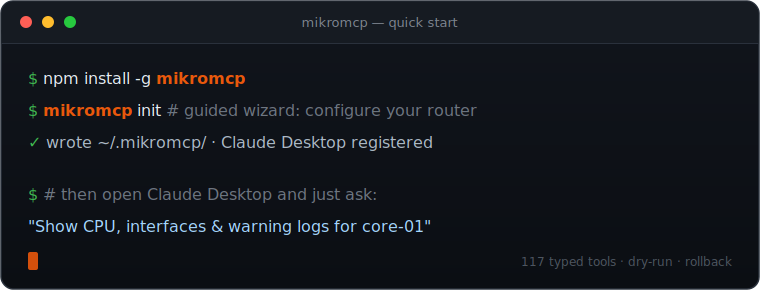

# MikroMCP

<p align="center">
  <picture>
    <source media="(prefers-color-scheme: dark)" srcset="./docs/assets/MikroMCP-logo-dark.png">
    <source media="(prefers-color-scheme: light)" srcset="./docs/assets/MikroMCP-logo-light.png">
    
  </picture>
</p>

> **AI-native network automation for MikroTik RouterOS.** MikroMCP exposes RouterOS as a typed, auditable [Model Context Protocol](https://modelcontextprotocol.io) server so Claude, Cursor, Codex, and other MCP clients can inspect, diagnose, and safely operate MikroTik routers in natural language.

[](https://github.com/AliKarami/MikroMCP/actions/workflows/ci.yml)
[](https://github.com/AliKarami/MikroMCP/actions/workflows/release.yml)
[](package.json)
[](LICENSE)
[](package.json)
[](https://help.mikrotik.com/docs/display/ROS/REST+API)
[](https://modelcontextprotocol.io)
[](https://github.com/AliKarami/MikroMCP/wiki/Available-Tools)
[](https://glama.ai/mcp/servers/AliKarami/MikroMCP)

MikroMCP exists because raw router CLI access is the wrong abstraction for AI agents. RouterOS is powerful, but asking an LLM to improvise shell commands against production network gear is risky. MikroMCP gives agents a controlled tool surface: strict schemas, idempotent writes, dry-run previews, per-router circuit breakers, retry policies, RBAC, audit logs, snapshots, and rollback-aware change workflows.

**In one sentence:** MikroMCP turns MikroTik RouterOS into a production-minded MCP control plane for AI infrastructure, DevOps automation, and modern router management.


---

## Quick Start

<p align="center">
  
</p>

That's the whole setup for a single-router stdio deployment. For standalone binaries, Docker, HTTP/SSE mode, the RouterOS API prerequisites, and the full 15-minute walkthrough, see the **[Getting Started guide](https://github.com/AliKarami/MikroMCP/wiki/Getting-Started)**.

---

## Feature Showcase

| Category                   | What MikroMCP covers                                                                                  |
| -------------------------- | ----------------------------------------------------------------------------------------------------- |
| 🧭 **Router management**   | System status, clock, reboot, packages, files, scripts, scheduler jobs, containers                    |
| 🌐 **Network operations**  | Interfaces, VLANs, IP addresses, DHCP leases, DNS static records, bridge ports, WiFi clients          |
| 🔥 **Firewall and policy** | Filter/NAT rules, mangle rules, address lists, route tables, routing rules                            |
| 🛰️ **Routing visibility**  | Static routes, routing tables, BGP peers, OSPF neighbors                                              |
| 🔐 **Secure access**       | HTTP bearer auth, bcrypt token hashes, RBAC, router/tool restrictions, confirmation tokens            |
| 🧪 **Diagnostics**         | Router-originated `ping`, `traceroute`, `torch`, log filtering, guarded SSH command execution         |
| 🛡️ **Change safety**       | Dry-run, idempotent writes, snapshots, write journal, `plan_changes`, `apply_plan`, `rollback_change` |
| ⚙️ **Production behavior** | Retries for read tools, per-router circuit breakers, correlation IDs, structured logs, audit logs     |
| 🤖 **AI-agent fit**        | Human-readable responses plus structured JSON content for reasoning, chaining, and automation; server advertises an `instructions` string on MCP initialize so clients self-configure; optional [`routerId` resolved via `MIKROMCP_DEFAULT_ROUTER`](https://github.com/AliKarami/MikroMCP/wiki/Configuration) for single-router setups; [usage skill](docs/wiki/Using-the-Skill.md) for safe, guided tool use in Claude Code |
| 🧩 **MCP compatibility**   | stdio for desktop clients, Streamable HTTP and legacy SSE for remote or service-style clients         |

**118 typed tools** in total — browse the full catalog with parameters, defaults, and copy-paste example prompts in **[Available Tools](https://github.com/AliKarami/MikroMCP/wiki/Available-Tools)**.

---

## Demo

### Usage

<p align="center">
  
</p>

### Review by Claude


---

## Real-World Usage Examples

### Router Inspection

```text
Use MikroMCP to inspect core-01. Summarize system resources, RouterOS version,
running interfaces, active routes, DNS settings, and recent warning/error logs.
Flag anything that looks operationally risky.
```

### Firewall Management

```text
List firewall filter and NAT rules on edge-01. Identify disabled rules,
overlapping port forwards, broad accept rules, and anything without comments.
Do not change anything yet.
```

### Safe Static Route Change

```text
Dry-run a route on core-01 for 10.20.0.0/16 via 192.168.88.1 in the main table.
Show the exact planned diff and tell me whether an existing route conflicts.
```

### WireGuard Operations

```text
Show WireGuard peers on branch-02. Sort by last handshake age and flag peers
that have not handshaken recently or have no transfer counters.
```

### Interface Diagnostics

```text
Check interface health on edge-01, then run ping and traceroute from the router
to 1.1.1.1. If packet loss is present, use torch on the WAN interface for a
short traffic snapshot.
```

### Plan / Apply / Rollback Workflow

```text
Create a change plan that adds a DNS record and a firewall address-list entry
on edge-01. Use dry-run first, explain the plan, then wait for approval before
applying anything.
```

---

## Why MikroMCP Is Useful For AI Agents

MCP gives LLMs a standard way to call tools. MikroMCP makes RouterOS a high-quality MCP target by turning network operations into well-described, machine-readable, permission-aware actions.

AI assistants can use MikroMCP to:

- Investigate router state without memorizing RouterOS command syntax.
- Chain tool calls across interfaces, routes, firewall rules, logs, and diagnostics.
- Return both operator-friendly summaries and structured JSON for follow-up reasoning.
- Preview changes before mutation and explain exactly what would happen.
- Respect tool-level authorization, router scoping, maintenance windows, and confirmation gates.

---

## FAQ

### What is MikroMCP?

MikroMCP is an open-source [Model Context Protocol](https://modelcontextprotocol.io) (MCP) server that exposes MikroTik RouterOS as 118 typed, auditable tools — letting AI assistants inspect, diagnose, and safely operate routers in natural language instead of improvising CLI commands.

### MikroMCP vs RouterOS API

The RouterOS REST/API exposes raw endpoints. MikroMCP wraps them in schema-validated, idempotent, dry-run-able tools with RBAC, audit logging, snapshots, and rollback — the safety layer an LLM needs before it touches production gear.

### MikroMCP vs SSH automation

Instead of brittle SSH scripts that screen-scrape CLI output, MikroMCP returns structured, typed results with confirmation gates and per-router circuit breakers. SSH is used only where REST can't reach — `ping`, `traceroute`, `torch`, and guarded `run_command`.

### MikroMCP for Claude Code

MikroMCP speaks MCP over stdio and HTTP/SSE, so Claude Code and Claude Desktop drive RouterOS directly. Pair it with the bundled [usage skill](docs/wiki/Using-the-Skill.md) for safe, guided workflows.

### MikroMCP for Codex

Codex connects to MikroMCP over the standard MCP protocol — see [Connecting to AI Assistants](https://github.com/AliKarami/MikroMCP/wiki/Connecting-to-AI-Assistants).

### MikroMCP for Cursor

Cursor connects to MikroMCP as an MCP server (stdio or HTTP) to inspect and manage MikroTik routers without leaving the editor.

### MikroMCP for OpenClaw

Any MCP-compatible client — OpenClaw included — can use MikroMCP; configure it as a stdio or HTTP MCP server.

### RouterOS AI Automation Guide

Start with [Getting Started](https://github.com/AliKarami/MikroMCP/wiki/Getting-Started) to install and connect, then use the [usage skill](docs/wiki/Using-the-Skill.md) and [Available Tools](https://github.com/AliKarami/MikroMCP/wiki/Available-Tools) to automate RouterOS safely with an AI assistant.

### Best MCP Servers for Network Engineers

MikroMCP is purpose-built for MikroTik/RouterOS operations with production-grade safety — dry-run, rollback, audit, and RBAC — making it a strong MCP choice for network engineers adopting AI tooling.

---

## Documentation

The README stays intentionally short. Everything below is documented in depth in the [wiki](https://github.com/AliKarami/MikroMCP/wiki):

| Resource                                                                                              | Use it for                                                 |
| ----------------------------------------------------------------------------------------------------- | ---------------------------------------------------------- |
| [Getting Started](https://github.com/AliKarami/MikroMCP/wiki/Getting-Started)                         | Install (npm, binary, Docker), configure, and connect in 15 minutes |
| [RouterOS API Setup](https://github.com/AliKarami/MikroMCP/wiki/RouterOS-API-Setup)                   | Enable the REST API, create a user, TLS and firewall       |
| [Configuration](https://github.com/AliKarami/MikroMCP/wiki/Configuration)                             | Router registry, credentials, all environment variables    |
| [Running](https://github.com/AliKarami/MikroMCP/wiki/Running)                                         | Run commands, HTTP/SSE transport, troubleshooting          |
| [Connecting to Claude Desktop](https://github.com/AliKarami/MikroMCP/wiki/Connecting-to-Claude-Desktop) | Register MikroMCP in Claude Desktop                      |
| [Connecting to AI Assistants](https://github.com/AliKarami/MikroMCP/wiki/Connecting-to-AI-Assistants) | Claude Code, Cursor, Codex, HTTP/Docker/systemd            |
| [Using the Skill](docs/wiki/Using-the-Skill.md)                                                        | Install the MikroMCP usage skill so your assistant drives the tools safely |
| [Available Tools](https://github.com/AliKarami/MikroMCP/wiki/Available-Tools)                         | All 118 tools — parameters and example prompts             |
| [Architecture](https://github.com/AliKarami/MikroMCP/wiki/Architecture)                               | System layers, request pipeline, auth model                |
| [Error Handling](https://github.com/AliKarami/MikroMCP/wiki/Error-Handling)                           | Error categories, retry engine, circuit breaker            |
| [Security](https://github.com/AliKarami/MikroMCP/wiki/Security)                                       | Threat model, hardening checklist, vulnerability reporting |
| [Development](https://github.com/AliKarami/MikroMCP/wiki/Development)                                 | Project structure, tests, MCP Inspector workflow           |
| [Contributing](https://github.com/AliKarami/MikroMCP/wiki/Contributing)                               | Adding tools, coding conventions, PR checklist             |
| [Roadmap](https://github.com/AliKarami/MikroMCP/wiki/Roadmap) · [ROADMAP.md](ROADMAP.md)              | Shipped milestones and guiding principles                  |

---

## Contributing

Issues, bug reports, tool requests, documentation improvements, and pull requests are welcome.

Good first contributions:

- Add a read-only tool for an uncovered RouterOS surface.
- Add screenshots, demo GIFs, or topology diagrams.
- Expand tests around RouterOS response normalization and idempotency edge cases.
- Help validate RouterOS version compatibility across real MikroTik devices and CHR.

Development standards:

- TypeScript strict mode, ESM imports with `.js` extensions
- Zod schemas with `.strict()`, idempotency and `dryRun` for write tools
- `MikroMCPError` for domain errors, focused Vitest coverage for every tool

Please open an issue before large changes so maintainers can align on scope.

---

## Security

MikroMCP controls real network devices — treat it like an operations system: least-privilege RouterOS users, verified TLS (or pinned fingerprints), credentials only in `~/.mikromcp/.env`, scoped RBAC identities, and audit logging for shared use. The full hardening checklist and vulnerability-reporting process are on the [Security page](https://github.com/AliKarami/MikroMCP/wiki/Security).

---

## Community And Support

- ⭐ Star the repository if MikroMCP helps your MikroTik or MCP workflow.
- 🍴 Fork it to add RouterOS surfaces your network depends on.
- 🧵 Open an issue for bugs, feature requests, compatibility notes, or documentation gaps.

---

## License

MikroMCP is released under the [MIT License](LICENSE).
