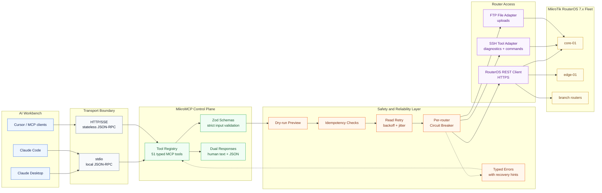
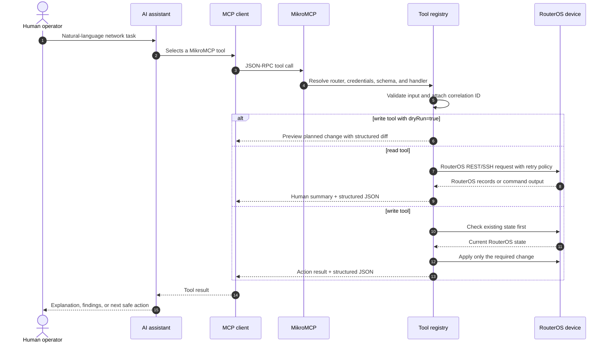
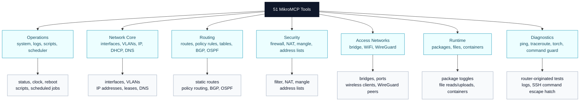

# MikroMCP: MikroTik RouterOS MCP Server for AI Network Automation

> Production-grade [Model Context Protocol (MCP)](https://modelcontextprotocol.io) server for MikroTik RouterOS. MikroMCP lets AI assistants such as Claude Desktop, Claude Code, Cursor, and other MCP clients safely inspect and manage MikroTik routers through the RouterOS REST API.

[](LICENSE)
[](package.json)
[](https://help.mikrotik.com/docs/display/ROS/REST+API)
[](https://modelcontextprotocol.io)

MikroMCP turns MikroTik RouterOS into a structured, typed, controlled tool surface for LLMs. Instead of asking an assistant to invent RouterOS CLI commands, you connect the assistant to MikroMCP and give it validated tools for reading system state, managing routes, updating firewall rules, checking DHCP leases, running diagnostics, handling WireGuard peers, managing scripts, and more.

## Why MikroMCP

- **Built for MikroTik RouterOS:** Uses RouterOS 7.x REST API paths and RouterOS field conventions directly.
- **Made for AI assistants:** Every tool has a Zod schema, descriptions for MCP clients, human-readable output, and structured JSON content.
- **Safer than raw shell access:** Write tools validate input, support dry-run mode, and implement idempotency checks before changing router state.
- **Production-minded behavior:** Per-router circuit breaker, retry engine for read-only tools, correlation IDs, structured logging, TLS fingerprint pinning, SSH fingerprint pinning, and HTTP hardening.
- **Multi-router from day one:** A single server instance can manage a fleet through `config/routers.yaml` and per-router environment credentials.

## Project Facts

| Fact | Value |
|---|---|
| Primary topic | MikroTik MCP server, RouterOS AI assistant, network automation |
| Protocols | Model Context Protocol, JSON-RPC 2.0, RouterOS REST API, SSH, FTP |
| Transports | stdio and HTTP/SSE |
| Router support | MikroTik RouterOS 7.x with REST API enabled |
| Runtime | Node.js 22+, TypeScript, ESM |
| Tool count | 51 MCP tools |
| Safety model | Zod validation, idempotent writes, dry-run, circuit breaker, retries, typed errors |
| Credential model | Router credentials come from environment variables, not YAML |
| License | MIT |

Keywords: `mikrotik mcp server`, `routeros mcp`, `mikrotik ai assistant`, `routeros rest api`, `model context protocol`, `network automation`, `mcp network tools`, `mikrotik router management`.

## What You Can Ask an AI Assistant To Do

With MikroMCP connected to an MCP client, prompts can become safe, structured router operations:

- "Show CPU, memory, uptime, interfaces, and recent warning logs for core-01."
- "List inactive DHCP leases and group them by server."
- "Dry-run a static route to 10.20.0.0/16 through 192.168.88.1."
- "Find disabled firewall NAT rules and explain what each one would do."
- "Check WireGuard peer handshakes and flag stale peers."
- "Ping 1.1.1.1 and traceroute to 8.8.8.8 from the router."
- "Create a scheduled RouterOS script job, but show the dry-run first."

## Architecture



## Request Lifecycle



## Quick Start

**Requirements**

- Node.js 22 or newer
- MikroTik RouterOS 7.x
- RouterOS REST API enabled
- RouterOS user with the policies needed by the tools you plan to use

**Required RouterOS user policies**

`read`, `write`, `api`, `rest-api`, `test`, `ssh`, `sniff`

`ssh` is needed by `ping`, `traceroute`, `torch`, and `run_command`, which execute via SSH because RouterOS 7.x REST permissions are limited for tool commands. `sniff` is additionally required by `torch` for packet-capture access.

If you use `upload_file`, also grant the RouterOS `ftp` policy to the router user.

```bash
git clone https://github.com/AliKarami/MikroMCP.git
cd MikroMCP
npm install
npm run build
cp config/routers.example.yaml config/routers.yaml
```

Edit `config/routers.yaml` with your router details, then provide credentials through environment variables:

```bash
export ROUTER_CORE01_USER=mcp-api
export ROUTER_CORE01_PASS=your-password
npm start
```

For the full router setup, REST API enablement, and least-privilege user walkthrough, see the [Setup Guide](https://github.com/AliKarami/MikroMCP/wiki/Setup-Guide).

## Connect Claude Desktop

Add MikroMCP to `~/Library/Application Support/Claude/claude_desktop_config.json`:

```json
{
  "mcpServers": {
    "mikrotik": {
      "command": "node",
      "args": ["/absolute/path/to/MikroMCP/dist/main.js"],
      "env": {
        "MIKROMCP_CONFIG_PATH": "/absolute/path/to/MikroMCP/config/routers.yaml",
        "ROUTER_CORE01_USER": "mcp-api",
        "ROUTER_CORE01_PASS": "your-password"
      }
    }
  }
}
```

MikroMCP also supports HTTP/SSE mode:

```bash
MIKROMCP_TRANSPORT=http MIKROMCP_PORT=3000 npm start
```

See [Connecting to an MCP Client](https://github.com/AliKarami/MikroMCP/wiki/Connecting-to-an-MCP-Client) for Claude Desktop, Claude Code, and other MCP clients.

## Available MCP Tools

MikroMCP currently exposes **51 MCP tools** across day-to-day operations, diagnostics, security, routing, automation, files, and containers.



| Area | Tools |
|---|---|
| System status | `get_system_status`, `get_system_clock`, `set_system_clock`, `reboot` |
| Interfaces and VLANs | `list_interfaces`, `create_vlan` |
| IP, DHCP, and DNS | `manage_ip_address`, `list_dhcp_leases`, `list_dns_entries`, `manage_dns_entry`, `get_dns_settings` |
| Routing | `list_routes`, `manage_route`, `list_routing_rules`, `manage_routing_rule`, `list_routing_tables`, `manage_routing_table` |
| Routing protocols | `list_bgp_peers`, `list_ospf_neighbors` |
| Firewall | `list_firewall_rules`, `manage_firewall_rule`, `list_mangle_rules`, `manage_mangle_rule`, `list_address_list_entries`, `manage_address_list_entry` |
| Bridge | `list_bridges`, `manage_bridge`, `manage_bridge_port` |
| WiFi and wireless | `list_wifi_interfaces`, `list_wifi_clients`, `manage_wifi_interface` |
| WireGuard | `list_wireguard_interfaces`, `list_wireguard_peers`, `manage_wireguard_peer` |
| Diagnostics | `ping`, `traceroute`, `torch`, `get_log` |
| RouterOS scripts and scheduler | `list_scripts`, `manage_script`, `run_script`, `list_scheduled_jobs`, `manage_scheduled_job` |
| Packages and files | `list_packages`, `manage_package`, `list_files`, `get_file_content`, `upload_file` |
| Containers | `list_containers`, `manage_container` |
| Escape hatch | `run_command` |

Full parameter tables and example prompts are in [Available Tools](https://github.com/AliKarami/MikroMCP/wiki/Available-Tools).

## Safety and Reliability

| Capability | How MikroMCP handles it |
|---|---|
| Input validation | Strict Zod schemas reject unexpected fields and invalid values before a tool runs. |
| Idempotent writes | Write tools check existing RouterOS state before create, update, remove, enable, or disable actions. |
| Dry-run mode | Write tools can preview changes without applying them. |
| Typed errors | RouterOS, validation, conflict, not-found, and network failures are mapped to structured `MikroMCPError` categories. |
| Retry behavior | Read-only tools retry transient failures with exponential backoff and jitter. |
| Circuit breaker | Each router has an independent breaker so one failing device does not poison the whole fleet. |
| Secret handling | Router usernames and passwords are read from environment variables, not committed configuration. |
| Transport hardening | HTTP mode supports bind host, request body limits, and per-IP rate limiting. |
| Pinning | RouterOS TLS and SSH host-key fingerprints can be pinned per router. |

## Authentication

MikroMCP uses bearer token authentication. Each identity is defined in `config/identities.yaml` with a bcrypt-hashed token, a role, and optional router/tool restrictions. See `config/identities.example.yaml` for the full format.

**HTTP transport** — every request must include `Authorization: Bearer <token>`. The server rejects unauthenticated calls with 401.

**stdio transport** — no bearer token is required. The process identity defaults to a built-in `superadmin` with no restrictions. Set `MIKROMCP_STDIO_IDENTITY` to use a named identity from `identities.yaml` instead.

Generate a token hash for a new identity:

```bash
node -e "const b=require('bcryptjs'); b.hash('your-raw-token', 12).then(console.log)"
```

**RBAC** — each identity has `allowedRouters` (list of router IDs, or empty for all) and `allowedToolPatterns` (glob-style patterns, or empty for all). Destructive tools require a two-step confirmation unless the identity holds `admin` or `superadmin` role.

## Configuration

Router inventory lives in `config/routers.yaml`; credentials live in environment variables that match each router's `envPrefix`.

| Variable | Default | Purpose |
|---|---|---|
| `MIKROMCP_TRANSPORT` | `stdio` | `stdio` or `http` transport |
| `MIKROMCP_CONFIG_PATH` | `config/routers.yaml` | Router registry path |
| `MIKROMCP_LOG_LEVEL` | `info` | `trace`, `debug`, `info`, `warn`, or `error` |
| `MIKROMCP_PORT` | `3000` | HTTP transport port |
| `MIKROMCP_BIND_HOST` | `127.0.0.1` | HTTP bind address |
| `MIKROMCP_HTTP_MAX_BODY_BYTES` | `1048576` | HTTP request body cap |
| `MIKROMCP_HTTP_RATE_LIMIT_RPM` | `60` | HTTP requests per minute per IP; `0` disables rate limiting |
| `MIKROMCP_IDENTITIES_PATH` | `config/identities.yaml` | Path to identity/token registry |
| `MIKROMCP_STDIO_IDENTITY` | none | Named identity used for stdio transport (defaults to built-in superadmin) |
| `MIKROMCP_CONFIRMATION_SECRET` | none | HMAC secret for confirmation tokens (**required** in HTTP mode) |
| `MIKROMCP_AUDIT_LOG_PATH` | none | NDJSON audit log file path (omit to disable file sink) |
| `ROUTER_<PREFIX>_USER` | none | Router username for a registry entry |
| `ROUTER_<PREFIX>_PASS` | none | Router password for a registry entry |

See [Configuration](https://github.com/AliKarami/MikroMCP/wiki/Configuration) for YAML examples, TLS options, SSH fingerprint pinning, and HTTP transport settings.

## Development

```bash
npm run dev          # tsx watch hot-reload
npm run build        # build ESM output to dist/main.js
npm start            # run built server
npm test             # run Vitest once
npm run typecheck    # TypeScript type checking
npm run lint         # ESLint
npm run format       # Prettier
```

Before committing changes:

```bash
npm test
npm run typecheck
```

Project entry points:

| Path | Purpose |
|---|---|
| `src/main.ts` | Loads config and starts stdio or HTTP transport |
| `src/mcp/tool-registry.ts` | Registers tools, injects router clients, retry, circuit breaker, and credentials |
| `src/domain/tools/` | Tool definitions and handlers |
| `src/adapter/rest-client.ts` | RouterOS REST API client |
| `src/config/router-registry.ts` | Router inventory loader |
| `config/routers.example.yaml` | Example multi-router registry |

## Documentation

| Guide | What it covers |
|---|---|
| [Architecture](https://github.com/AliKarami/MikroMCP/wiki/Architecture) | System layers, request pipeline, and reliability boundaries |
| [Setup Guide](https://github.com/AliKarami/MikroMCP/wiki/Setup-Guide) | End-to-end setup from router to AI assistant |
| [Configuration](https://github.com/AliKarami/MikroMCP/wiki/Configuration) | Router registry YAML, credentials, env vars, and HTTP transport |
| [Running](https://github.com/AliKarami/MikroMCP/wiki/Running) | Development and production commands |
| [Connecting to an MCP Client](https://github.com/AliKarami/MikroMCP/wiki/Connecting-to-an-MCP-Client) | Claude Desktop, Claude Code, and other clients |
| [Available Tools](https://github.com/AliKarami/MikroMCP/wiki/Available-Tools) | All 51 tools with parameters and example prompts |
| [Error Handling](https://github.com/AliKarami/MikroMCP/wiki/Error-Handling) | Error categories, circuit breaker, and retry engine |
| [Development](https://github.com/AliKarami/MikroMCP/wiki/Development) | Project structure, testing, and MCP Inspector usage |
| [Contributing](https://github.com/AliKarami/MikroMCP/wiki/Contributing) | Adding tools, style guide, and PR checklist |
| [Roadmap](https://github.com/AliKarami/MikroMCP/wiki/Roadmap) | v0.1-v0.7 shipped; v0.8-v1.0 planned |

## Roadmap Snapshot

- **v0.1-v0.6:** Foundation, routing, firewall, diagnostics, network services, policy routing, security hardening, automation, packages, files, and containers.
- **v0.7 ✅:** HTTP bearer token auth, RBAC enforcement, dual-sink audit log, two-step confirmation gate, and credential surface reduction.
- **v0.8:** Change safety, snapshots, diffs, write journal, plan/apply, and rollback.
- **v0.9:** Fleet operations, IPSec, certificates, users, queues, SNMP, Netwatch, NTP, and health checks.
- **v1.0:** Prometheus metrics, CHR integration tests, npm/Docker/systemd distribution, `mikromcp doctor`, stability policy, and security documentation.

See [ROADMAP.md](ROADMAP.md) for the full milestone plan.

## License

MikroMCP is released under the MIT License. See [LICENSE](LICENSE).
