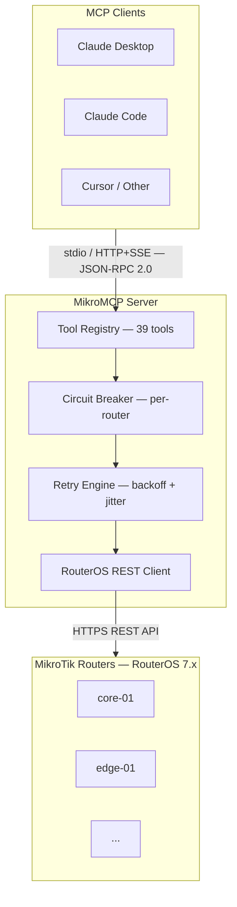

# 🔧 MikroMCP

> A production-grade [Model Context Protocol (MCP)](https://modelcontextprotocol.io) server that gives AI assistants (Claude, Cursor, etc.) safe, structured access to MikroTik RouterOS devices via the RouterOS REST API.

---

## 💡 What it does

MikroMCP exposes MikroTik router management as MCP tools. An AI assistant connected to MikroMCP can query system status, list interfaces, manage VLANs, IP addresses, DHCP leases, static routes, and firewall rules — all through natural language, with the server enforcing validation, idempotency, and safety guardrails.

| | |
|---|---|
| ♻️ **Auto-retry** | Read-only tools retry with exponential backoff + jitter on transient failures |
| ✅ **Idempotent writes** | Creating something that already exists returns success, not an error |
| 🔍 **Dry-run mode** | Preview changes on all write tools before applying |
| ⚡ **Circuit breaker** | Per-router — trips after N consecutive failures, self-heals after cooldown |
| 📦 **Dual responses** | Every tool returns both a human-readable summary and a structured JSON block |
| 🔒 **Zero secrets in config** | Credentials come from environment variables, never from YAML |
| 🌐 **Multi-router** | Manage any number of routers from a single server instance |

---

## 🗺️ How it works



---

## 🚀 Quick start

**Requirements:** Node.js >= 22 · MikroTik RouterOS 7.x with REST API enabled

**Required RouterOS user policies:** `read`, `write`, `api`, `rest-api`, `test`, `ssh`, `sniff`

> `ssh` is needed by `ping`, `traceroute`, `torch`, and `run_command`, which execute via SSH due to RouterOS 7.x REST API permission limitations for tool commands. `sniff` is additionally required by `torch` for packet-capture access.

```bash
git clone https://github.com/AliKarami/MikroMCP.git
cd MikroMCP
npm install && npm run build
cp config/routers.example.yaml config/routers.yaml
# Edit config/routers.yaml with your router details
export ROUTER_CORE01_USER=mcp-api
export ROUTER_CORE01_PASS=your-password
npm start
```

Then add to Claude Desktop (`~/Library/Application Support/Claude/claude_desktop_config.json`):

```json
{
  "mcpServers": {
    "mikrotik": {
      "command": "node",
      "args": ["/absolute/path/to/MikroMCP/dist/main.js"],
      "env": {
        "MIKROMCP_CONFIG_PATH": "/absolute/path/to/MikroMCP/config/routers.yaml",
        "ROUTER_CORE01_USER": "mcp-api",
        "ROUTER_CORE01_PASS": "your-password"
      }
    }
  }
}
```

For the full walkthrough including router user setup, see the **[📖 Setup Guide](https://github.com/AliKarami/MikroMCP/wiki/Setup-Guide)**.

---

## 🛠️ Available tools

| Tool | Type | Description |
|---|---|---|
| `get_system_status` | 👁️ Read | CPU, memory, uptime, identity |
| `list_interfaces` | 👁️ Read | Network interfaces with running/MAC/type filtering and pagination |
| `create_vlan` | ✏️ Write | Create VLAN interfaces (idempotent) |
| `manage_ip_address` | ✏️ Write | Add / update / remove IP addresses |
| `list_dhcp_leases` | 👁️ Read | DHCP lease table with filtering |
| `list_routes` | 👁️ Read | Routing table with active/static filters |
| `manage_route` | ✏️ Write | Add or remove static routes (idempotent) |
| `list_firewall_rules` | 👁️ Read | Filter/NAT rules in evaluation order |
| `manage_firewall_rule` | ✏️ Write | Add / remove / disable / enable firewall rules |
| `ping` | 👁️ Read | Send ICMP echo from the router; returns RTT stats and packet loss |
| `traceroute` | 👁️ Read | Path tracing from the router to a destination |
| `torch` | 👁️ Read | Real-time traffic snapshot for an interface |
| `get_log` | 👁️ Read | Read and filter system log by topic, prefix, or time range |
| `get_system_clock` | 👁️ Read | Read system time and timezone |
| `set_system_clock` | ✏️ Write | Set system time and timezone (idempotent, dry-run) |
| `reboot` | ✏️ Write | Controlled router reboot with optional delay and dry-run |
| `run_command` | ✏️ Write | Run any RouterOS CLI command via SSH with allowlist/denylist guardrails |
| `list_bridges` | 👁️ Read | List bridge interfaces and port members |
| `manage_bridge` | ✏️ Write | Create or remove a bridge interface (idempotent) |
| `manage_bridge_port` | ✏️ Write | Add or remove an interface as a bridge port (idempotent) |
| `list_wifi_interfaces` | 👁️ Read | List WiFi/wireless interfaces (ROS-version-aware path) |
| `list_wifi_clients` | 👁️ Read | List connected WiFi clients with signal strength |
| `manage_wifi_interface` | ✏️ Write | Enable, disable, or update SSID on a WiFi interface |
| `list_wireguard_interfaces` | 👁️ Read | List WireGuard interfaces and status |
| `list_wireguard_peers` | 👁️ Read | List WireGuard peers with handshake and transfer stats |
| `manage_wireguard_peer` | ✏️ Write | Add or remove a WireGuard peer (idempotent by public key) |
| `list_dns_entries` | 👁️ Read | List static DNS entries with name/type filtering |
| `manage_dns_entry` | ✏️ Write | Add or remove a static DNS entry (idempotent by name+type) |
| `get_dns_settings` | 👁️ Read | Read DNS resolver configuration |
| `list_mangle_rules` | 👁️ Read | List mangle rules in evaluation order with chain/action/disabled filtering |
| `manage_mangle_rule` | ✏️ Write | Add / remove / enable / disable mangle rules (idempotent by comment) |
| `list_address_list_entries` | 👁️ Read | List firewall address list entries with list/address filtering |
| `manage_address_list_entry` | ✏️ Write | Add or remove an address list entry (idempotent by list+address) |
| `list_routing_rules` | 👁️ Read | List policy routing rules in evaluation order |
| `manage_routing_rule` | ✏️ Write | Add / remove / enable / disable routing rules (idempotent by composite key) |
| `list_routing_tables` | 👁️ Read | List custom routing tables |
| `manage_routing_table` | ✏️ Write | Create or remove a routing table (idempotent by name) |
| `list_bgp_peers` | 👁️ Read | List BGP sessions with state, prefix counts, and uptime (RouterOS 7+) |
| `list_ospf_neighbors` | 👁️ Read | List OSPF neighbors with state, interface, and uptime (RouterOS 7+) |

Full parameter tables and example prompts: **[📋 Available Tools](https://github.com/AliKarami/MikroMCP/wiki/Available-Tools)**

---

## 📚 Documentation

| | |
|---|---|
| [🏗️ Architecture](https://github.com/AliKarami/MikroMCP/wiki/Architecture) | System layers and request pipeline |
| [📖 Setup Guide](https://github.com/AliKarami/MikroMCP/wiki/Setup-Guide) | End-to-end from bare router to working AI assistant |
| [⚙️ Configuration](https://github.com/AliKarami/MikroMCP/wiki/Configuration) | Router registry YAML, credentials, env vars, HTTP transport |
| [▶️ Running](https://github.com/AliKarami/MikroMCP/wiki/Running) | Dev and production scripts |
| [🔌 Connecting to an MCP Client](https://github.com/AliKarami/MikroMCP/wiki/Connecting-to-an-MCP-Client) | Claude Desktop, Claude Code, and other clients |
| [🛠️ Available Tools](https://github.com/AliKarami/MikroMCP/wiki/Available-Tools) | All 39 tools with parameters and example prompts |
| [🚨 Error Handling](https://github.com/AliKarami/MikroMCP/wiki/Error-Handling) | Error categories, circuit breaker, retry engine |
| [🧪 Development](https://github.com/AliKarami/MikroMCP/wiki/Development) | Project structure, scripts, testing, MCP Inspector |
| [🤝 Contributing](https://github.com/AliKarami/MikroMCP/wiki/Contributing) | Adding tools, guidelines, PR checklist |
| [🗺️ Roadmap](https://github.com/AliKarami/MikroMCP/wiki/Roadmap) | v0.1 ✅ · v0.2 ✅ · v0.3 ✅ · v0.4 ✅ · v0.5 ✅ · v0.6–v1.0 planned |

---

## 📄 License

MIT — see [LICENSE](LICENSE).
