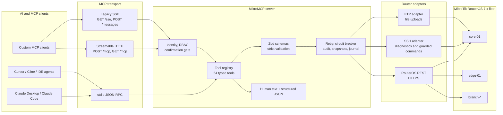
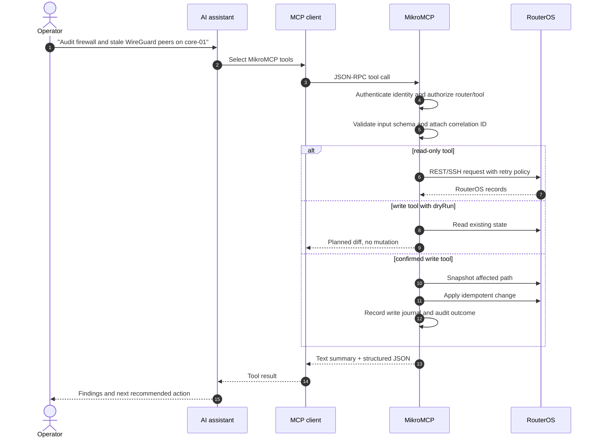
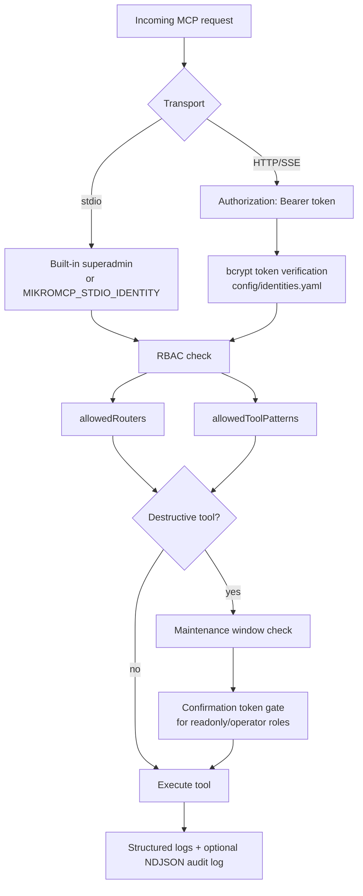

# Architecture

## System Overview

```mermaid
flowchart LR
    subgraph Clients["AI and MCP clients"]
        Claude["Claude Desktop / Claude Code"]
        Cursor["Cursor / Cline / IDE agents"]
        Service["Custom MCP clients"]
    end

    subgraph Transport["MCP transport"]
        Stdio["stdio JSON-RPC"]
        Http["Streamable HTTP<br/>POST /mcp, GET /mcp"]
        Sse["Legacy SSE<br/>GET /sse, POST /messages"]
    end

    subgraph Core["MikroMCP server"]
        Registry["Tool registry<br/>54 typed tools"]
        Schemas["Zod schemas<br/>strict validation"]
        Auth["Identity, RBAC<br/>confirmation gate"]
        Safety["Retry, circuit breaker<br/>audit, snapshots, journal"]
        Format["Human text + structured JSON"]
    end

    subgraph Adapters["Router adapters"]
        Rest["RouterOS REST<br/>HTTPS"]
        Ssh["SSH adapter<br/>diagnostics and guarded commands"]
        Ftp["FTP adapter<br/>file uploads"]
    end

    subgraph Routers["MikroTik RouterOS 7.x fleet"]
        CoreRouter["core-01"]
        EdgeRouter["edge-01"]
        BranchRouter["branch-*"]
    end

    Claude --> Stdio
    Cursor --> Stdio
    Service --> Http
    Service --> Sse
    Stdio --> Registry
    Http --> Auth
    Sse --> Auth
    Auth --> Registry
    Registry --> Schemas
    Schemas --> Safety
    Safety --> Rest
    Safety --> Ssh
    Safety --> Ftp
    Rest --> CoreRouter
    Rest --> EdgeRouter
    Rest --> BranchRouter
    Ssh --> CoreRouter
    Ftp --> CoreRouter
    Registry --> Format
```

## Tool Execution Flow

```mermaid
sequenceDiagram
    autonumber
    actor User as Operator
    participant Agent as AI assistant
    participant MCP as MCP client
    participant Server as MikroMCP
    participant Router as RouterOS

    User->>Agent: "Audit firewall and stale WireGuard peers on core-01"
    Agent->>MCP: Select MikroMCP tools
    MCP->>Server: JSON-RPC tool call
    Server->>Server: Authenticate identity and authorize router/tool
    Server->>Server: Validate input schema and attach correlation ID

    alt read-only tool
        Server->>Router: REST/SSH request with retry policy
        Router-->>Server: RouterOS records
    else write tool with dryRun
        Server->>Router: Read existing state
        Server-->>MCP: Planned diff, no mutation
    else confirmed write tool
        Server->>Router: Snapshot affected path
        Server->>Router: Apply idempotent change
        Server->>Server: Record write journal and audit outcome
    end

    Server-->>MCP: Text summary + structured JSON
    MCP-->>Agent: Tool result
    Agent-->>User: Findings and next recommended action
```

## Authentication And Safety Model

```mermaid
flowchart TD
    Request["Incoming MCP request"] --> Transport{"Transport"}
    Transport -->|stdio| StdioIdentity["Built-in superadmin<br/>or MIKROMCP_STDIO_IDENTITY"]
    Transport -->|HTTP/SSE| Bearer["Authorization: Bearer token"]
    Bearer --> TokenHash["bcrypt token verification<br/>config/identities.yaml"]
    StdioIdentity --> RBAC["RBAC check"]
    TokenHash --> RBAC
    RBAC --> RouterScope["allowedRouters"]
    RBAC --> ToolScope["allowedToolPatterns"]
    RouterScope --> Destructive{"Destructive tool?"}
    ToolScope --> Destructive
    Destructive -->|no| Execute["Execute tool"]
    Destructive -->|yes| Window["Maintenance window check"]
    Window --> Confirm["Confirmation token gate<br/>for readonly/operator roles"]
    Confirm --> Execute
    Execute --> Audit["Structured logs + optional NDJSON audit log"]
```
