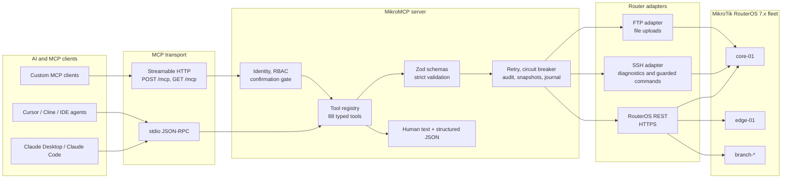
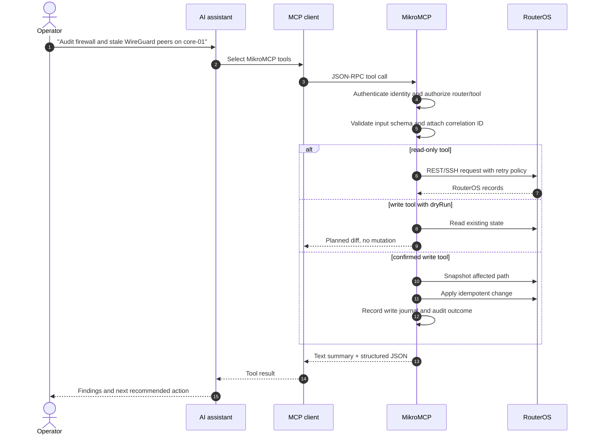
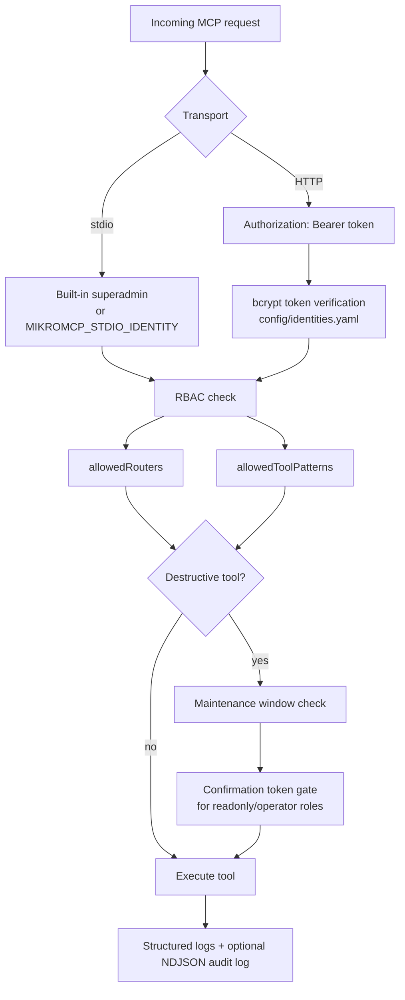

# Architecture

## System Overview

## Tool Execution Flow

## Authentication and Safety Model

## Key Components

| Component | File | Responsibility |
|---|---|---|
| Entry point | `src/main.ts` | Loads config, selects transport, starts server |
| Tool registry | `src/mcp/tool-registry.ts` | Registers tools; injects circuit breaker, retry, correlation ID, credentials |
| All tools | `src/domain/tools/index.ts` | Aggregates all 88 `ToolDefinition` arrays |
| REST client | `src/adapter/rest-client.ts` | `get`, `getOne`, `create`, `update`, `remove`, `execute` over HTTPS |
| SSH adapter | `src/adapter/ssh-client.ts` | Runs `/tool/ping`, `/tool/traceroute`, `/tool/torch`, and `run_command` |
| FTP adapter | `src/adapter/ftp-client.ts` | Uploads files via `upload_file` |
| Snapshot engine | `src/domain/snapshot/snapshot-engine.ts` | Captures RouterOS section state before writes |
| Write journal | `src/domain/snapshot/write-journal.ts` | Append-only record of writes with rollback metadata |
| Auth middleware | `src/mcp/authz.ts` | Enforces RBAC at call time |
| Router registry | `src/config/router-registry.ts` | Loads and validates `config/routers.yaml` |

## Transport Options

| Mode | How to start | Use case |
|---|---|---|
| **stdio** (default) | `mikromcp serve` (no env needed) | Local: Claude Desktop, Claude Code, Cursor — the assistant spawns MikroMCP as a child process |
| **HTTP** | `MIKROMCP_TRANSPORT=http mikromcp serve` | Remote / shared: Docker, systemd, multiple clients connecting to one instance |

HTTP transport listens at `POST /mcp` (call) and `GET /mcp` (SSE event stream) on `MIKROMCP_PORT` (default 3000). Every request must carry `Authorization: Bearer <token>`.

## Safety Guarantees

- **Read tools** carry automatic exponential-backoff retry (up to 3 attempts). The circuit breaker does not trip on read failures.
- **Write tools** are idempotent — each checks existing state before acting and returns `already_exists` / `no_change` when nothing needs to be done.
- **All write tools** support `dryRun: true` to preview the planned change without touching the router.
- **Destructive tools** (`reboot`, `manage_user`, and others flagged `destructiveHint: true`) require a short-lived HMAC confirmation token in HTTP mode.
- **Snapshots** are taken of affected RouterOS paths before `apply_plan` runs a write sequence, enabling `rollback_change` to restore previous state.
- **Audit log** records every write and destructive call with identity, tool name, router, parameters (credentials redacted), and outcome.
